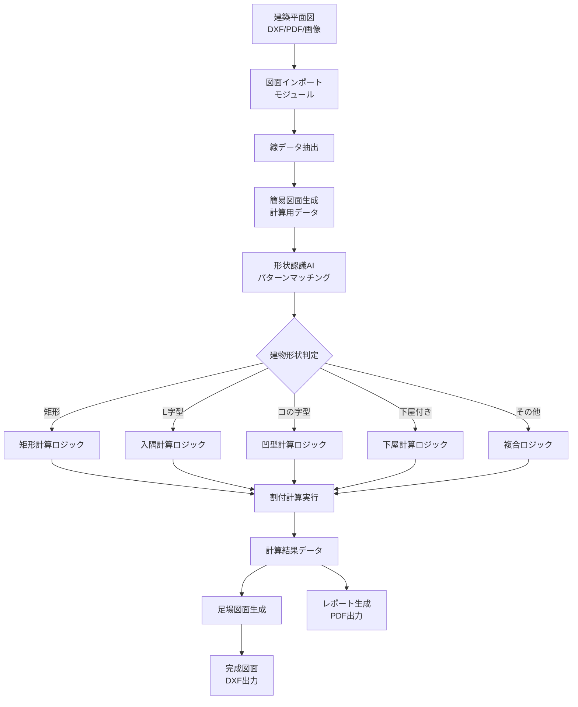
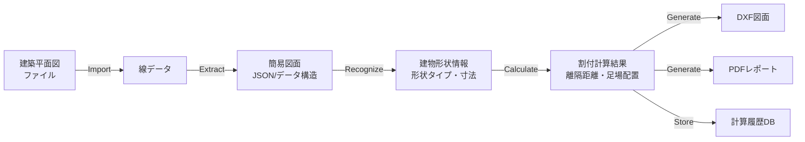

# 足場割付計算システム - プロジェクト概要

> [!NOTE]
> このドキュメントは足場割付計算システムの全体像を示すマスタードキュメントです。プロジェクトの現状、将来ビジョン、技術アーキテクチャを包括的に記述しています。

## 目次

1. [プロジェクト概要](#プロジェクト概要)
2. [現状の機能](#現状の機能)
3. [将来ビジョン](#将来ビジョン)
4. [技術アーキテクチャ](#技術アーキテクチャ)
5. [実装済みロジック一覧](#実装済みロジック一覧)
6. [ロードマップ](#ロードマップ)

---

## プロジェクト概要

### 目的

足場図面の作図業務を**完全自動化**することで、以下を実現します:

- **作業時間の大幅削減**: 手作業での図面作成から解放
- **計算精度の保証**: 人的ミスの排除と標準化
- **再利用可能なロジック**: API化により様々なシステムから利用可能
- **LLMとの統合**: 自然言語インターフェースによる操作

### 解決する課題

足場図面の作図業務における以下の課題に対処します:

1. **複雑な計算ルール**: 建築基準法、労働安全衛生規則に準拠した計算
2. **多様な建物形状**: 矩形、L字型、コの字型、下屋付きなど様々な形状への対応
3. **繰り返し作業**: 類似した計算処理の手作業による実施
4. **属人化**: 熟練者の知識に依存する業務フロー
5. **図面データの処理**: 建築平面図から計算に必要な情報を抽出する複雑さ

### 最終目標

**建築平面図をインポートし、自動的に足場割付計算を実行し、完成された足場図面を出力する完全自動化システムの構築**

```
建築平面図（DXF/PDF） 
    ↓ インポート
簡易図面（計算用線データ）
    ↓ 自動認識
建物形状・寸法の抽出
    ↓ 自動計算
足場割付計算ロジック
    ↓ 生成
完成した足場図面
```

---

## 現状の機能

### Phase 1: 計算ロジックの構築 ✅ **進行中**

現在は、足場割付計算の**ロジックを蓄積し、コード化する段階**です。将来的に自動化システムと統合するための基盤を構築しています。

#### 実装済みの計算ロジック

| ロジック名 | 用途 | 実装ステータス |
|-----------|------|--------------|
| **基本離隔距離計算** | 建物外周から足場までの最適距離を計算 | ✅ 完了 |
| **矩形建物割付** | 単純矩形の足場割付計算 | ✅ 完了 |
| **入隅計算** | L字型建物の入隅部分の割付 | ✅ 完了 |
| **凹型建物計算** | コの字型建物の複雑な割付 | ✅ 完了 |
| **下屋付き建物計算** | 高さ段差のある建物の処理 | ✅ 完了 |
| **階段形状計算** | 階段状の建物形状への対応 | ✅ 完了 |
| **突出建物計算** | 出隅のある建物の処理 | ✅ 完了 |

#### 現在のワークフロー

```
自然言語でのロジック説明
    ↓
ロジック分析・構造化
    ↓
計算式への変換
    ↓
Pythonコード実装
    ↓
テスト・検証
    ↓
ドキュメント化
```

---

## 将来ビジョン

### 建築平面図インポート機能

> [!IMPORTANT]
> これはプロジェクトの最重要機能であり、完全自動化の鍵となります。

#### 実現したいこと

1. **平面図のインポート**
   - DXF、PDF、画像ファイルなどの建築平面図を読み込み
   - CADデータの線情報を抽出

2. **簡易図面への自動変換**
   - 計算に必要な線のみを抽出（建物外周線、入隅線、下屋境界線など）
   - 不要な詳細情報（窓、ドア、内装など）を除去
   - 計算用の標準化されたデータ構造に変換

3. **建物形状の自動認識**
   - 矩形、L字型、コの字型などの形状パターンを自動判定
   - 入隅・出隅の検出
   - 高さ段差（下屋）の検出

4. **自動計算の実行**
   - 認識した形状に応じて適切な計算ロジックを選択
   - 実装済みのロジックを使用して割付計算を実行
   - 計算結果をデータとして出力

5. **完成図面の生成**
   - 計算結果を基に足場図面を自動生成
   - DXF形式での出力
   - レポート生成（計算根拠、使用部材リストなど）

#### エンドツーエンドの自動化フロー



---

## 技術アーキテクチャ

### 現在のシステム構成

```
Scaff-logic/
├── src/logic/              # 計算ロジック（コアビジネスロジック）
│   ├── spacing.py          # 離隔距離計算
│   ├── inside_corner.py    # 入隅計算
│   ├── concave_shape.py    # 凹型建物計算
│   ├── stair_shape.py      # 階段形状計算
│   ├── shed_building.py    # 下屋付き建物計算
│   └── protrusion_building.py  # 突出建物計算
├── docs/logic/             # ロジック仕様書
└── tests/                  # ユニットテスト
```

### 将来のシステム構成（平面図処理を含む）

```
Scaff-logic/
├── src/
│   ├── import/             # 【新規】図面インポートモジュール
│   │   ├── dxf_parser.py   # DXFファイル解析
│   │   ├── pdf_parser.py   # PDF図面解析
│   │   └── image_parser.py # 画像OCR・線検出
│   ├── converter/          # 【新規】簡易図面変換モジュール
│   │   ├── line_extractor.py    # 必要な線の抽出
│   │   ├── shape_recognizer.py  # 形状認識
│   │   └── data_normalizer.py   # データ標準化
│   ├── logic/              # 【既存】計算ロジック
│   │   └── (既存のロジックファイル)
│   ├── orchestrator/       # 【新規】計算オーケストレーター
│   │   └── calculator.py   # 形状に応じた計算ロジック選択
│   ├── generator/          # 【新規】図面生成モジュール
│   │   ├── dxf_generator.py  # DXF図面生成
│   │   └── report_generator.py # レポート生成
│   ├── api/                # 【将来】REST API
│   └── mcp/                # 【将来】MCP Server
├── docs/
│   ├── architecture/       # 【新規】アーキテクチャドキュメント
│   └── logic/              # 【既存】ロジック仕様書
└── tests/
    ├── integration/        # 【新規】統合テスト
    └── unit/               # 【既存】ユニットテスト
```

### 技術スタック

#### 現在

- **Python 3.11+**: コア開発言語
- **Dataclasses**: データ構造定義
- **pytest**: テストフレームワーク

#### 将来追加予定

| 機能領域 | 技術 | 用途 |
|---------|------|------|
| **図面解析** | ezdxf | DXFファイルの読み書き |
|  | PyMuPDF (fitz) | PDF図面の解析 |
|  | OpenCV | 画像からの線検出 |
|  | Tesseract OCR | 図面文字認識 |
| **形状認識** | scikit-learn | パターンマッチング |
|  | TensorFlow/PyTorch | AI形状認識（将来的に） |
| **API化** | FastAPI | REST API実装 |
|  | Pydantic | データバリデーション |
|  | MCP Python SDK | MCP Server実装 |
| **図面生成** | ezdxf | DXF図面出力 |
|  | ReportLab | PDFレポート生成 |

### データフロー



---

## 実装済みロジック一覧

### 1. 基本離隔距離計算

**ファイル**: [spacing.py](file:///Users/kazuto/Desktop/Scaff-logic/src/logic/spacing.py)  
**ドキュメント**: [basic_allocation_procedure.md](file:///Users/kazuto/Desktop/Scaff-logic/docs/logic/basic_allocation_procedure.md)

建物外周から足場までの離隔距離を最適化する計算ロジック。

**主な機能**:
- 目標離隔距離900mmに最も近い配置を計算
- 軒の出を考慮した最小離隔距離の自動調整
- 足場総長さが300mmの倍数になるよう最適化

**使用例**:
```python
from src.logic.spacing import calculate_optimal_clearance

result = calculate_optimal_clearance(
    building_width=5460,     # 建物幅
    target_clearance=900.0,  # 目標離隔距離
    eave_overhang=600        # 軒の出
)
# result.clearance → 870mm
# result.scaffold_total_length → 7200mm
```

---

### 2. 入隅（内角）計算

**ファイル**: [inside_corner.py](file:///Users/kazuto/Desktop/Scaff-logic/src/logic/inside_corner.py)  
**ドキュメント**: [inside_corner_calculation.md](file:///Users/kazuto/Desktop/Scaff-logic/docs/logic/inside_corner_calculation.md)

L字型建物の入隅部分における足場割付を計算。

**主な機能**:
- 入隅辺の離隔距離計算
- 外周辺との連携を考慮した最適化
- 複数の入隅辺の連鎖計算

**特徴**:
- 同じ面の外周辺の離隔距離を基準とする
- 垂直方向の入隅辺の長さを考慮
- 300mmの倍数を引いて最適化

---

### 3. 凹型（コの字型）建物計算

**ファイル**: [concave_shape.py](file:///Users/kazuto/Desktop/Scaff-logic/src/logic/concave_shape.py)  
**ドキュメント**: [concave_shape_calculation.md](file:///Users/kazuto/Desktop/Scaff-logic/docs/logic/concave_shape_calculation.md)

コの字型（凹型）建物の複雑な足場割付を計算。

**主な機能**:
- 2つの出隅（外角）の処理
- 外接矩形を基準とした計算
- 出隅辺の離隔距離の最適化

---

### 4. 下屋付き建物計算

**ファイル**: [shed_building.py](file:///Users/kazuto/Desktop/Scaff-logic/src/logic/shed_building.py)  
**ドキュメント**: [shed_building_calculation.md](file:///Users/kazuto/Desktop/Scaff-logic/docs/logic/shed_building_calculation.md)

平面図では矩形だが高さに段差がある建物の処理。

**主な機能**:
- 本体部分と下屋部分の識別
- 高さ段差を考慮した足場面積計算
- 内部境界の処理

**特徴**:
- 平面的には単純矩形として計算
- 高さ別の足場配置を考慮
- 下屋上に入隅がある複合形状にも対応

---

### 5. 階段形状計算

**ファイル**: [stair_shape.py](file:///Users/kazuto/Desktop/Scaff-logic/src/logic/stair_shape.py)  
**ドキュメント**: [stair_shape_calculation.md](file:///Users/kazuto/Desktop/Scaff-logic/docs/logic/stair_shape_calculation.md)

階段状に段差のある建物形状の割付計算。

---

### 6. 突出建物計算

**ファイル**: [protrusion_building.py](file:///Users/kazuto/Desktop/Scaff-logic/src/logic/protrusion_building.py)

建物の一部が突出している形状への対応。

---

## ロードマップ

### Phase 1: 計算ロジックの構築 ✅ **現在のフェーズ**

**目標**: 多様な建物形状に対応する計算ロジックを蓄積

**実施内容**:
- ✅ 基本的な離隔距離計算ロジック
- ✅ 矩形建物の割付計算
- ✅ L字型建物（入隅）の計算
- ✅ コの字型建物（凹型）の計算
- ✅ 下屋付き建物の計算
- ✅ 階段形状・突出建物の計算
- ✅ ユニットテストの作成
- ✅ ドキュメントの整備

**成果物**:
- Pythonで実装された再利用可能な計算ロジック
- 各ロジックの詳細仕様書
- テストケースとテストコード

---

### Phase 2: API化とMCP統合 ⏳ **次のフェーズ**

**目標**: 計算ロジックをAPIとして提供し、LLMから利用可能にする

**予定内容**:
- [ ] FastAPIによるREST API実装
- [ ] MCP Serverの実装
- [ ] API仕様書の作成
- [ ] Tool/Function Calling対応
- [ ] 認証・認可の実装

**技術要素**:
- FastAPI
- MCP Python SDK
- Pydantic（バリデーション）
- OpenAPI仕様

---

### Phase 3: 図面インポート機能 🎯 **重要フェーズ**

**目標**: 建築平面図をインポートし、計算用の簡易図面に自動変換

> [!WARNING]
> このフェーズは技術的難易度が高く、以下の課題に対処する必要があります:
> - 多様な図面フォーマットへの対応
> - 線データの正確な抽出
> - 建物形状の自動認識精度

**予定内容**:
- [ ] DXFファイルパーサーの実装
- [ ] PDFファイル解析機能
- [ ] 画像ファイルからの線検出（OpenCV）
- [ ] 計算に必要な線の自動抽出アルゴリズム
- [ ] 建物形状の自動認識（パターンマッチング）
- [ ] 簡易図面データ構造の標準化
- [ ] データ変換パイプラインの構築

**技術要素**:
- **DXF処理**: ezdxf
- **PDF処理**: PyMuPDF (fitz)
- **画像処理**: OpenCV
- **OCR**: Tesseract
- **形状認識**: scikit-learn、カスタムアルゴリズム

**成果物**:
- 図面インポートモジュール
- 線抽出アルゴリズム
- 形状認識エンジン
- 簡易図面データフォーマット仕様

---

### Phase 4: 完全自動化システム 🚀 **最終目標**

**目標**: 図面インポートから完成図面生成までのエンドツーエンド自動化

**予定内容**:
- [ ] 計算オーケストレーターの実装
- [ ] 形状に応じた自動ロジック選択
- [ ] 計算結果の検証システム
- [ ] DXF図面自動生成
- [ ] PDFレポート生成
- [ ] Webインターフェースの構築
- [ ] 計算履歴管理システム

**自動化フロー**:
```
1. ユーザーが建築平面図をアップロード（DXF/PDF/画像）
2. システムが自動的に線データを抽出
3. 建物形状を自動認識（矩形/L字/コの字/下屋付き等）
4. 認識した形状に応じて適切な計算ロジックを選択
5. 割付計算を自動実行
6. 完成した足場図面（DXF）とレポート（PDF）を生成
7. ユーザーにダウンロード提供
```

**技術要素**:
- **図面生成**: ezdxf、ReportLab
- **Webフレームワーク**: FastAPI + React/Vue.js
- **ストレージ**: PostgreSQL、S3/MinIO
- **ジョブキュー**: Celery + Redis

---

### Phase 5: AI強化とクラウド展開 ✨ **将来構想**

**目標**: AIによる高度な形状認識とクラウドサービス化

**構想内容**:
- [ ] ディープラーニングによる形状認識（TensorFlow/PyTorch）
- [ ] 複雑な建物形状への対応拡張
- [ ] クラウドサービスとしての提供（AWS/GCP/Azure）
- [ ] モバイルアプリ対応
- [ ] リアルタイムコラボレーション機能
- [ ] 3D可視化機能

---

## まとめ

### 現在の位置づけ

このプロジェクトは現在、**Phase 1: 計算ロジックの構築**段階にあります。多様な建物形状に対応する計算ロジックを順次実装し、将来的な自動化システムの基盤を構築しています。

### 将来の展望

最終的には、**建築平面図を入力するだけで、完成した足場図面が自動生成される完全自動化システム**を実現します。これにより:

- ✅ 作図時間を90%以上削減
- ✅ 計算ミスをゼロに
- ✅ 標準化された高品質な図面を提供
- ✅ 熟練者でなくても高度な図面作成が可能

### 次のステップ

1. **Phase 1の完了**: 残りの計算ロジックの実装と検証
2. **Phase 2への移行**: API化とMCP統合の着手
3. **Phase 3の準備**: 図面インポート技術の調査研究

---

## 関連ドキュメント

- **プロジェクト設定**: [CLAUDE.md](file:///Users/kazuto/Desktop/Scaff-logic/CLAUDE.md)
- **クイックスタート**: [README.md](file:///Users/kazuto/Desktop/Scaff-logic/README.md)
- **用語集**: [glossary.md](file:///Users/kazuto/Desktop/Scaff-logic/docs/glossary.md)
- **ロジック仕様書**: [docs/logic/](file:///Users/kazuto/Desktop/Scaff-logic/docs/logic/)

---

**最終更新**: 2025-11-22  
**バージョン**: 1.0.0
